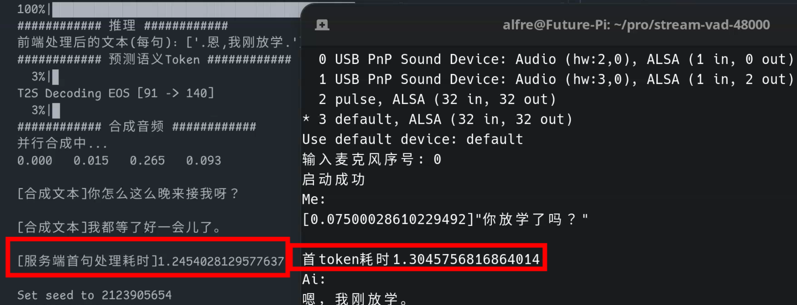

# 基于GPT-SoVITS的语音交互系统
## 简介
一个非常基础的语音交互系统，使用GPT-SoVITS作为TTS模块。集成ASR接口，使用funasr作为语音识别模块基础。支持openai规范的大模型接口。
Linux环境下首Token延迟基本能做到1.5s以内。Windows环境下延迟在2.1s左右
### 测试平台
服务端
- OS：Manjaro
- CPU：R9 5950X
- GPU：RTX 3080ti

客户端
- 树莓派5

### 测试结果

## 整合包使用说明
百度网盘链接: https://pan.baidu.com/s/1mf6hHJt8hVW3G2Yp2gC3Sw?pwd=2333 提取码: 2333
### 注意！重要的事情说三遍
### 服务端只会对英文""符号包裹的文本进行语音合成，使用前请修改大模型的提示词！
### 服务端只会对英文""符号包裹的文本进行语音合成，使用前请修改大模型的提示词！
### 服务端只会对英文""符号包裹的文本进行语音合成，使用前请修改大模型的提示词！
整合包不包含用于推理的GPT跟SoVITS模型，需要自行添加底模或者训练好的模型。
### Windows
```bash
runtime\python.exe chat_server.py
```
### Linux
```bash
# 安装依赖
pip install -r extra-req.txt
pip install -r requirements.txt

# 运行
python chat_server.py
```
### 配置说明
整合包配置文件为config.yaml
```yaml
Core:
  sv:                    # 声纹配置  
    is_up: true          # 是否启用声纹识别
    master_audio:        # 音频路径
    thr:                 # 不知道有什么用暂时留空
LLM:
  api:                   # 大模型API
  key:                   # 大模型API_Key
  model:                 # 模型名称
GSV:
  text_lang: zh          # 合成文本的语种
  GPT_weight:            # GPT_weight模型路径
  SoVITS_weight:         # SoVITS_weight模型路径
  ref_audio_path:        # 主要参考音频路径
  prompt_text:           # 参考音频文本
  prompt_lang: zh        # 参考音频语种
  aux_ref_audio_paths:   # 多参考音频
    -                    # 多参考音频文件路径
  seed: -1               # 种子
  top_k: 15              # 情感表现程度，越高情感越丰富，也可能越奇怪
  batch_size: 1
extra_ref_audio:         # 使用情绪标签选择参考音频，例如 [普通]"你好呀。"
  # 实例
  普通: 
    - 参考音频路径
    - 参考音频文本
```

### 简易客户端使用方法
#### Windows
测试使用python 3.10

首先修改client.py文件asr_api、chat_api的ip地址。
```bash
# 创建python虚拟环境
python -m venv pp
.\pp\Scripts\pip.exe install -r client-requirements.txt

# 运行
.\pp\Scripts\python.exe client.py
```

### 带简单GUI的客户端
```bash
# 创建python虚拟环境
python -m venv pp
.\pp\Scripts\pip.exe install -r client-requirements.txt
.\pp\Scripts\pip.exe install flet[all]

# 运行
.\pp\Scripts\python.exe client-gui\src\client_gui.py
```

### 在客户端上修改提示词的方法
此方法不适用于ollama，非必要情况下可以使用LMstudio
```bash
# 打开client_cli.py文件，GUI简易客户端打开client-gui\src\utils.py文件，修改下面内容
# 修改前
# 用于存储上下文内容
data = {
    "msg": []
}

#修改后
# 用于存储上下文内容
data = {
    "msg": [
        {"role":"system", "content": ```填入你的提示词```}
    ]
}
```

## 接口说明
接口全部使用POST请求。

#### ASR语音识别接口
```python
# url为/api/asr
# 请求数据格式为json
# 将音频数据编码成urlsafe的base64字符串，放进请求体data字段中
{
  "data": str # base64音频数据
}
# 服务端直接返回识别结果文本
```

#### 对话接口
```python
# 对话接口为sse流式接口，服务端会将大模型的回答切片并生成对应的语音数据，一段一段返回客户端
# 请求数据格式为json
# 将大模型上下文数据放进msg字段，类型为字符串数组
# 请求例子
{
  "msg": [
    {"role": "user", "content": "你好呀！"},
    {"role": "assistant", "content": "你好呀！有什么能帮到你的吗？"},
    {"role": "user", "content": "1+1等于多少呢？"},
  ]
}

# 服务端响应例子
{
  "file": str     # urlsafe的base64字符串音频文件
  "message": str  # 音频数据对应的文本
  "done": False   # bool类型，用于判断是否为最后一个数据包
}
# 最后一个数据包服务端会将大模型完整的回答文本放进message字段返回客户端
{
  "file": str
  "message": str  # 字符串类型，大模型完整回答文本，用于拼接上下文
  "done": True    # bool类型，用于判断是否为最后一个数据包
}
```
